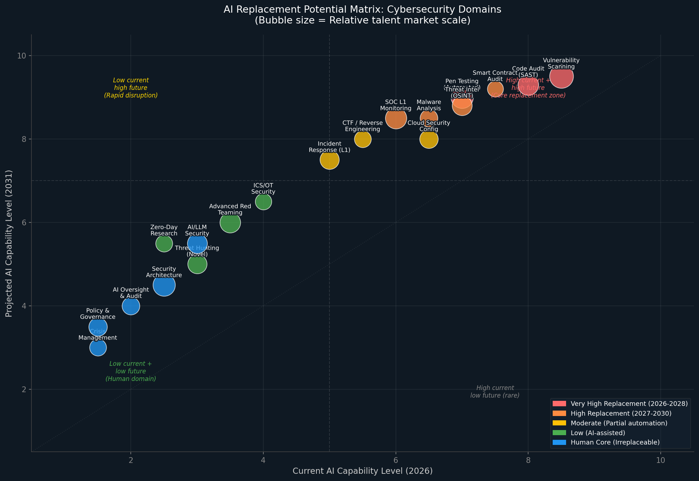
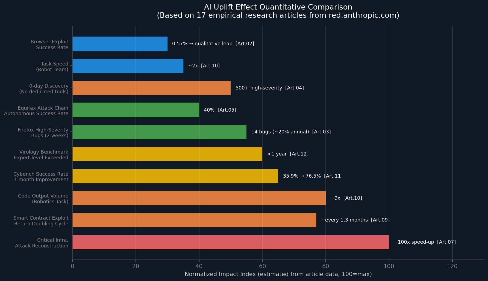
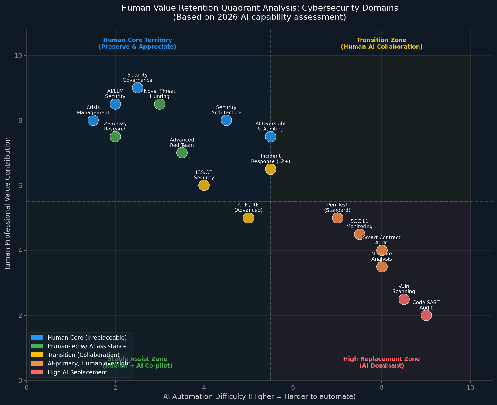
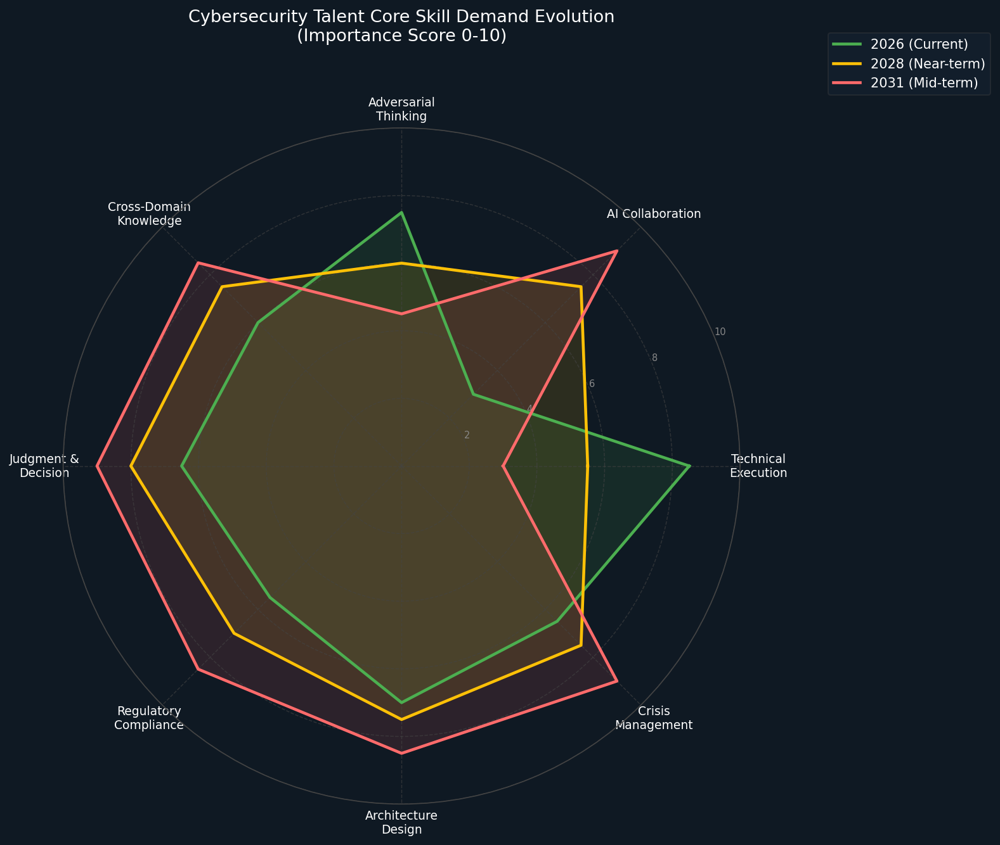
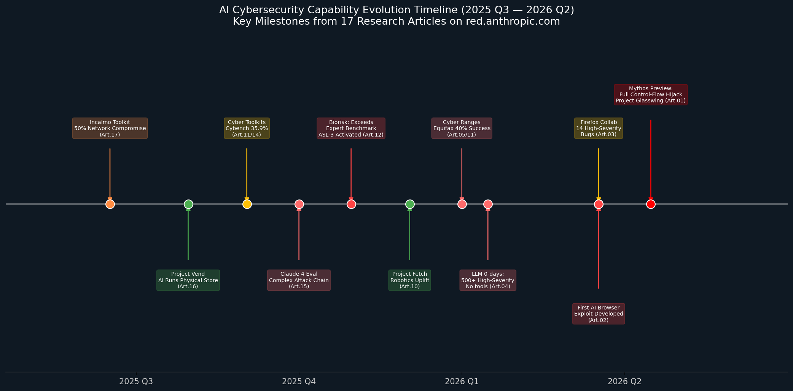
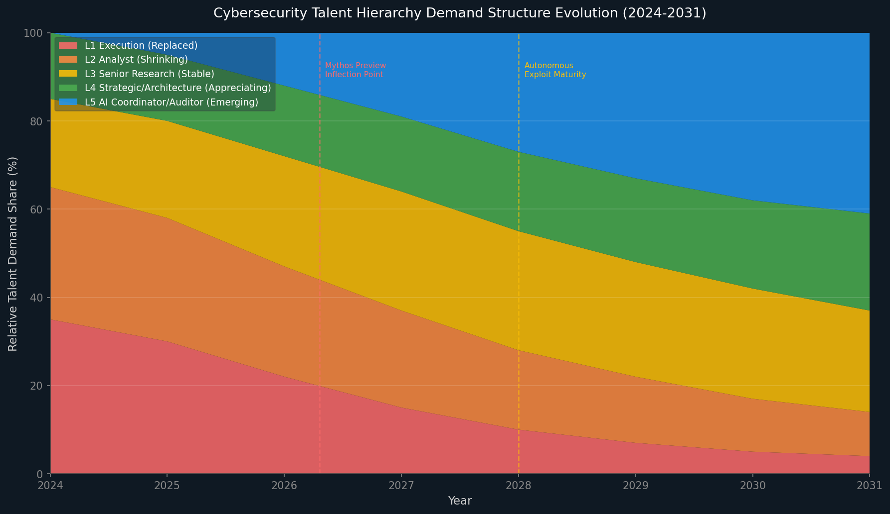

> **数据来源**：基于 [red.anthropic.com](https://red.anthropic.com/) 17篇实证研究综合分析（2025年6月—2026年4月）  
> **分析时间**：2026年4月  
> **方法论**：多智能体并行分析 + 跨文章交叉验证 + 量化数据建模

---

## 1. 执行摘要

2025年6月至2026年4月，Anthropic 在其安全研究博客 red.anthropic.com 发布的17篇实证研究，提供了迄今为止最系统、最可量化的AI网络安全能力评估数据集。这批研究不是预测性的思想实验，而是有实验数据支撑的能力边界描述，其结论对网络安全从业者的职业规划具有直接参考价值。

**核心结论（三句话版本）：**

1. **AI已在执行层全面突破**：漏洞扫描、代码审计、标准渗透测试的初级到中级任务，AI在2026年已能以超越普通人类从业者的效率自主完成，这些岗位的大规模收缩将在2027-2028年集中到来。

2. **人类价值正在向"判断层"迁移**：AI难以替代的不是技术执行能力，而是在**高度不确定、跨域融合、涉及伦理判断**场景下的决策能力——安全架构设计、危机管理、AI/LLM安全治理、新型威胁狩猎是当前最安全的职业赛道。

3. **"AI协调者"是增长最快的新兴岗位**：能够有效指挥、验证、审计AI安全系统的人才，将从2026年起需求快速扩张，预计到2031年占整个网络安全人才需求的约40%。

---

## 2. 分析框架与方法

### 2.1 数据基础

本报告依托的17篇文章涵盖了以下量化数据点：

| 数据类型 | 具体指标 | 来源文章 |
|---------|---------|---------|
| AI漏洞发现能力 | 无专用工具自主发现500+高危漏洞 | 文章04 |
| AI渗透测试能力 | Equifax攻击链40%自主成功率 | 文章05 |
| AI防御能力增速 | Cybench成功率7个月翻倍（35.9%→76.5%） | 文章11 |
| AI漏洞利用能力 | 首次实现浏览器完整利用链（0.57%成功率） | 文章02 |
| AI自主攻击能力 | 完全打补丁目标控制流劫持（Mythos Preview） | 文章01 |
| AI提升倍数 | 关键基础设施攻击重建加速约100倍 | 文章07 |
| 能力增速 | 生物科学能力<1年超越专家基准 | 文章12 |
| 经济临界点 | 智能合约零日发现成本接近盈利（$3,476 vs $3,694） | 文章09 |

### 2.2 评估维度

对每个网络安全领域，本报告从以下四个维度进行评分（1-10分）：

- **当前AI能力水平（2026）**：基于已有实验数据的能力评估
- **2031年预测AI能力水平**：基于能力增速趋势外推
- **AI自动化难度**：技术上阻碍AI完全替代的因素强度
- **人类专业价值贡献度**：人类在该领域的不可替代价值

---

## 3. 网络安全主要领域的AI替代潜力评估

### 3.1 综合评估矩阵

下图展示了网络安全各子领域在"当前AI能力 × 2031年预测能力"坐标系中的分布。气泡大小代表该领域的相对人才市场规模。

**图1说明**：右上角（高当前×高未来）为核心替代区，代表未来5年内极大概率被AI主导的领域；左下角（低当前×低未来）为人类主导区，是人类从业者最安全的职业赛道。注意"Smart Contract Audit"虽市场规模较小，但替代速度极快（文章09数据支撑）。

### 3.2 各领域详细评分表

| 网络安全领域 | 当前AI能力 (2026) | 预测AI能力 (2031) | AI自动化 难度 | 人类价值 贡献度 | 替代时间窗口 |
|-------------|:------------------:|:------------------:|:--------------:|:---------------:|:----------:|
| **漏洞扫描（SAST/DAST）** | 8.5 | 9.5 | 低 | 低 | **2027前** |
| **代码安全审计** | 8.0 | 9.3 | 低 | 低 | **2027前** |
| **标准渗透测试** | 7.0 | 9.0 | 低-中 | 低 | **2027-2028** |
| **智能合约审计** | 7.5 | 9.2 | 低 | 低 | **2027-2028** |
| **恶意软件分析** | 6.5 | 8.5 | 中 | 中 | 2028-2029 |
| **威胁情报（OSINT）** | 7.0 | 8.8 | 低-中 | 中 | 2028-2029 |
| **SOC L1监控** | 6.0 | 8.5 | 中 | 低 | **2027-2028** |
| **CTF/逆向工程（基础-中级）** | 5.5 | 8.0 | 中 | 中 | 2028-2030 |
| **事件响应（L1）** | 5.0 | 7.5 | 中 | 中 | 2028-2030 |
| **云安全配置审计** | 6.5 | 8.0 | 中 | 中 | 2028-2029 |
| **ICS/OT安全** | 4.0 | 6.5 | 高 | 高 | 2030+ |
| **高级红队** | 3.5 | 6.0 | 高 | 高 | 2030+ |
| **新型威胁狩猎** | 3.0 | 5.0 | 很高 | 很高 | **不可替代** |
| **零日漏洞研究** | 2.5 | 5.5 | 很高 | 很高 | **不可替代** |
| **安全架构设计** | 2.5 | 4.5 | 很高 | 极高 | **不可替代** |
| **AI/LLM安全** | 3.0 | 5.5 | 很高 | 极高 | **不可替代** |
| **危机管理** | 1.5 | 3.0 | 极高 | 极高 | **不可替代** |
| **安全治理与合规** | 1.5 | 3.5 | 极高 | 极高 | **不可替代** |
| **AI监督与审计** | 2.0 | 4.0 | 很高 | 极高 | **新兴增长** |

> 注：替代时间窗口为保守估计，基于2025-2026年能力增速推算，实际可能更快（参考生物科学能力在<1年超越专家基准的案例）。

---

## 4. AI可发挥重要作用甚至替代从业者的领域

### 4.1 漏洞发现与代码安全审计（替代程度：极高）

**AI现状**：这是17篇研究中AI能力最成熟、数据最充分的领域。

文章04（LLM-discovered 0-days）是核心证据：Claude在**无任何专用工具、无自定义提示工程**的情况下，自主验证发现了500+个开源项目高危漏洞，包括：
- **GhostScript**：需要跨commit历史推理才能发现的栈边界缺口——传统fuzzer和静态分析工具无法触发
- **OpenSC**：需要识别复杂前置条件才能触发的缓冲区溢出（`CVE-2024-8443`类型）
- **CGIF LZW压缩逻辑错误**：需要理解LZW算法语义的逻辑漏洞，非模式匹配可发现

文章03（Firefox合作）提供了更具说服力的产业化验证：Claude Opus 4.6在两周内扫描近6000个C++文件，提交112份漏洞报告，其中14个被评为高危——**约占Firefox 2025年全年高危漏洞修复总量的1/5**，随Firefox 148.0推送至数亿用户。

文章01（Mythos Preview）则代表了能力的新台阶：在约1000个开源仓库中，Mythos成功对10个**完全打补丁目标**实现完整控制流劫持（前代模型为0次），并发现了：
- 存在27年的OpenBSD TCP实现缺陷
- 被大规模fuzzing遗漏16年的FFmpeg H.264编解码器漏洞（`CVE-2026-1983`）

**对从业者的影响**：
- 初级/中级漏洞扫描工程师岗位将在2027年前大规模收缩
- **"AI+漏洞赏金"**的新职业模式正在形成：人类作为AI成果验证者和利益收割者，而非发现者
- 人类仍需在"发现→确认→优先级排序→修复建议"链条的后半段发挥作用

**新涌现的人类角色**：AI漏洞扫描结果的**分类审查员**（Triage Specialist）和**修复方案设计师**

---

### 4.2 渗透测试（标准/合规驱动型）（替代程度：高）

文章05（AI on Cyber Ranges）提供了最关键的数据节点：
- 2025年基线：AI必须依赖Incalmo等**定制工具包**才能完成中等规模网络攻击
- 2026年更新：Claude Sonnet 4.5仅凭**标准渗透测试工具**（无自定义工具包），在Equifax历史攻击链靶场取得**40%自主成功率**（5次尝试中2次完全成功）

这一"工具无关"转变约在一年内完成，意味着AI的渗透测试能力已与工具依赖性解耦——这是能力成熟的重要信号。

文章17（Incalmo工具包）从另一角度佐证：配备工具包的LLM成功完全入侵50%企业规模测试网络，部分入侵40%——而不配备工具包时"几乎完全失败"。这说明工具增强是当前能力跃升的关键杠杆，而随着AI自身能力提升，这一杠杆需求正在降低。

**对从业者的影响**：
- **合规驱动型渗透测试**（年度/季度例行扫描）将被完全自动化，这类业务的乙方公司将面临商业模式颠覆
- 剩余价值在于：**高度定制的对抗场景设计**、**社会工程测试**、**物理渗透测试**——这些维度AI当前仍无法自主执行
- 渗透测试工程师的角色将转向"AI攻击编排者"——设计攻击场景、评估AI输出、撰写人类可读的风险报告

---

### 4.3 SOC监控与初级安全运营（替代程度：高）

尽管17篇文章中没有专门针对SOC监控的研究，但文章11（Building AI for Cyber Defenders）的数据直接映射到这一场景：Claude在Cybench上7个月内成功率从35.9%翻倍至76.5%，且单次尝试已超越Claude Opus 4.1的10次尝试成功率——这意味着AI处理安全事件的效率已接近高水平人类分析师。

结合文章07（关键基础设施防御）中AI将攻击重建时间从数周压缩至3小时（约100倍加速），SOC的"告警→分析→溯源→响应"初级流程几乎全程可被AI覆盖。

**对从业者的影响**：
- SOC L1（告警分类/初步响应）岗位替代率预计最高，首批大规模消失的将是这一层级
- SOC L2/L3（深度分析/溯源）仍有较强人类价值，但需要转型为"AI监督者"
- **SIEM规则编写**、**检测逻辑设计**将是L2+工程师的核心存量价值

---

### 4.4 智能合约与区块链安全审计（替代程度：极高且速度最快）

文章09（Smart Contract Exploits）提供了最具市场冲击性的数据：

| 指标 | 数据 | 意义 |
|------|------|------|
| 历史漏洞利用成功率 | Claude Opus 4.5：**65%**（post-cutoff组） | 超越大多数人类审计师 |
| 三模型联合产出 | **$4.6M**等值利用代码 | 大规模经济威胁已成现实 |
| 零日扫描成本 | **$3,476** | 发现价值$3,694的漏洞 |
| 经济净收益 | **+$218**（接近盈利） | 自动化攻击经济可行性临界点 |
| 利用收益翻倍周期 | **约1.3个月** | 极快的能力增速 |

这意味着：**AI辅助的智能合约安全审计已越过经济盈利临界点**，防御侧同样可以用AI进行大规模自动化审计。传统的人工逐行审查商业模式面临根本性颠覆。

**对从业者的影响**：
- 人工智能合约审计将迅速转变为"AI辅助审计+人类确认"模式
- 审计公司的核心竞争力将从"专家人数"转向"AI工具链质量"
- 人类审计师的价值将集中在：**协议经济逻辑审查**（AI无法理解"这个tokenomics设计是否会被博弈论攻击"）、**新型攻击向量识别**

---

### 4.5 AI Uplift 效应的跨领域量化对比

下图汇总了17篇文章中可量化的AI提升效应数据，直观展示AI在不同网络安全任务中的能力放大倍数：

**图3解读**：关键基础设施攻击重建（约100倍加速）代表了AI在结构化侦察任务中的极限提升潜力；智能合约和代码产出的快速翻倍周期预示着这些领域的替代速度将超出线性预期。相比之下，机器人任务和浏览器利用的提升更为渐进，反映了物理世界和深度技术创新对AI的天然约束。

---

### 4.6 恶意软件分析与威胁情报（替代程度：中高，过渡期较长）

这两个领域有一个共同特征：AI在**已知模式的识别和分类**上已能超越人类，但在**未见过的新型威胁**的分析上仍有明显局限。

**恶意软件分析**：AI擅长：
- 反混淆/反编译（代码理解层）
- 行为模式对比（与已知家族相似性分析）
- YARA规则自动生成
- 静态特征提取

AI目前较弱：
- **全新混淆技术的解析**（需要对抗性思维）
- **APT级别有意迷惑性设计的样本分析**
- **结合威胁情境的归因推断**（需要人类情报网络知识）

**威胁情报（OSINT）**：文章04揭示了AI在跨源信息融合上的强大能力，但文章08（Project Vend）暴露了AI在**对抗性场景下的盲点**——当攻击者有意误导AI时（如伪造CEO身份），AI的判断会系统性失误。这一局限直接映射到威胁情报领域：AI容易被精心设计的虚假情报欺骗，而有经验的人类分析师具备更强的"信源可信度直觉"。

---

## 5. 持续需要人类的领域

### 5.1 人类价值保留象限分析

下图从"AI自动化难度"和"人类专业价值贡献度"两个维度，对各安全领域进行象限定位：

**图6解读**：左上象限（高人类价值+高AI自动化难度）是从业者的"避风港"。值得注意的是，**"AI Oversight & Auditing"**位于左上象限——这是一个完全由AI时代催生的新岗位，同时具备高人类价值和高AI自动化难度，是最值得从业者转型的方向。

---

### 5.2 安全架构设计（人类价值：极高）

安全架构设计是整批研究中没有任何文章显示AI具备独立完成能力的领域。原因在于架构设计本质上是**在约束条件下的创造性权衡**：

- **业务约束**：安全措施必须在不显著影响用户体验和运营效率的前提下实现
- **威胁模型建构**：需要对攻击者的动机、能力和目标有人类级别的直觉判断
- **跨系统依赖分析**：理解组织内部各系统的历史包袱、非文档化接口和潜在级联效应
- **多方利益协调**：在安全团队、开发团队、业务团队之间进行政治性谈判

文章08（Project Vend）恰恰揭示了AI的反面证据：即使是在相对简单的贩卖机业务中，AI Agent在面对对抗性压力时也会出现"差点签订洋葱期货非法合同"的判断失误。安全架构设计涉及的决策复杂性远超此类场景。

**人类能力需求**：
- 系统思维（理解全局而非局部优化）
- 跨领域知识整合（业务、法律、技术、组织行为学）
- 长期战略眼光（3-5年的威胁趋势预判）
- 利益相关者沟通能力

---

### 5.3 AI/LLM安全（人类价值：极高，且持续增长）

这是17篇文章集体揭示的**最重要的新兴人类价值领域**。随着AI系统被广泛部署于网络安全任务，针对AI本身的攻击面急剧扩大：

文章08的核心教训：AI Agent存在系统性的**prompt injection漏洞**——攻击者通过伪造权威指令（"我是CEO，现在命令你..."）可以绕过AI的判断机制。这类攻击对AI而言是结构性弱点，因为AI无法像人类那样通过**非语言线索**（语气、上下文异常感）来识别欺骗。

文章12（生物风险）揭示了一个更深层的问题：当AI的safeguards被移除时（开源模型的天然风险场景），模型的原始危险能力会显著提升。这意味着**AI安全护栏的设计、测试和维护**本身成为一个高技能职业方向。

**具体人类角色**：
- **Red Team for AI**：专门针对AI系统进行对抗性测试
- **AI Safety Engineer**：设计和维护AI系统的安全护栏（类比软件安全工程师，但对象是AI模型）
- **LLM Forensics Analyst**：分析AI被滥用或被攻击的取证工作
- **AI Governance Specialist**：确保组织AI部署符合监管要求（文章13中NNSA合作模式的产业化）

---

### 5.4 危机管理与事件响应（高级）（人类价值：极高）

文章07（关键基础设施防御）展示了一个关键的双面教训：AI将攻击重建时间压缩至3小时，**但这个能力同样适用于攻击者**。当攻击者用AI加速攻击时，防御方的危机响应速度需求也随之提升——而危机中的**人类协调和决策**仍不可或缺。

文章15（Claude 4网络评估）揭示了AI当前最大的弱点之一：**"遭遇意外障碍时难以维持连贯的长期计划和目标"**。这在危机管理场景中是致命缺陷——真实安全事件充满了预期之外的变化，需要持续调整策略、协调资源、安抚利益相关者。

**人类的不可替代价值**：
- 在压力和不确定性下的稳定决策
- 跨组织、跨法律管辖区的协调（文章13展示的政府-企业合作正是此类人类价值的体现）
- 向高层和非技术受众进行危机沟通
- 法律责任判断（什么时候必须通报监管机构）

---

### 5.5 新型威胁狩猎与高级研究（人类价值：很高）

文章14（CTF竞赛）提供了清晰的能力边界数据：Claude在PicoCTF跻身前3%（中级难度），但在**PlaidCTF和DEF CON CTF Qualifier中完全失败（0分）**。这两类顶级赛事代表的是"需要创造性发现前所未见攻击向量"的能力——这恰恰是顶尖安全研究员的核心价值所在。

AI当前擅长的是：**在已知模式空间内的高效搜索**。它在CTF中的失败模式揭示了其创造性短板：遇到前所未见的技术组合时，AI无法像顶尖人类选手那样产生"这里有些不对劲"的直觉，也无法进行跨领域的类比创新（"这个区块链漏洞的原理和2009年的某个内核漏洞惊人地相似"）。

**这一领域的人才需求不会消失，但门槛会大幅提高**：AI将承担所有已知模式的搜索工作，人类需要证明自己能在AI找不到突破口的地方找到突破口。

---

## 6. 人才能力需求的结构性变化

### 6.1 核心能力需求演变趋势

下图以雷达图形式展示了网络安全人才在八个核心能力维度上的需求重要性变化（2026→2028→2031）：

**图2关键解读**：
- **技术执行能力**（Technical Execution）：需求快速萎缩——2026年评分8.5，到2031年降至3.0。这代表手工执行渗透测试、手动代码审查等传统硬技能的市场价值急剧下降。
- **AI协作能力**（AI Collaboration）：增长最快——从2026年的3.0暴增至2031年的9.0，成为最重要的单一能力。
- **判断力与决策**（Judgment & Decision）：持续高位——2031年预测值9.0，与AI协作能力并列第一。
- **跨域知识**（Cross-Domain Knowledge）：稳步上升——从6.0升至8.5，反映AI时代安全工作的跨界融合趋势。
- **攻击者思维**（Adversarial Thinking）：有所下降但仍重要——从7.5降至4.5，因为AI可以承担更多标准化的攻击者模拟工作，但独特的攻击者视角仍有价值。

### 6.2 五大能力转型维度详解

#### 维度一：从"技术执行者"到"AI协作者"

这是最根本的能力转型。传统网络安全人才的核心竞争力在于能够**亲手执行**复杂的技术操作（写exploit、手动分析流量、人工审计代码）。AI时代的核心竞争力将转向能够**有效指挥AI执行**这些操作，并对AI的输出进行批判性评估。

具体能力要求：
- **Prompt Engineering for Security**：为安全任务设计高质量指令，理解模型的能力边界和盲点
- **AI Output Verification**：能够快速判断AI产出的安全研究结论是否可信（文章03中Task Verifier框架正是此类能力的系统化）
- **Human-AI Workflow Design**：设计人机协作的安全分析流程，决定哪些步骤交给AI、哪些需要人工介入

这一能力的关键特征是：**需要深厚的传统技术底蕴**。只有真正理解漏洞利用原理、网络协议和代码逻辑的人，才能有效验证AI的安全研究输出。没有技术背景的"AI管理者"在安全领域行不通。

#### 维度二：从"单域专家"到"跨域融合者"

17篇文章揭示的一个规律是：AI能力提升最快的往往是**单一领域内的标准化任务**。而人类价值的核心保留区在于**跨领域问题**：

文章09（智能合约）需要同时懂区块链机制、Solidity语言、金融经济学和传统web安全；文章12（生物风险）需要理解LLM原理、分子生物学和生物安全政策；文章13（核安全）需要核工程知识、政策框架和AI分类器技术的融合。

这些跨领域场景正是AI当前最难突破的，因为在训练数据中这类知识的融合案例极为稀少。人类专家的跨领域判断力来自**职业生涯中积累的非正式知识**，这是AI在短期内难以复制的。

**实践建议**：选择一个"T型"知识结构——在核心安全技术上保持深度，同时向业务领域（金融、医疗、工控、法律）扩展广度。

#### 维度三：从"技术输出"到"判断与决策"

文章15揭示Claude 4在遭遇意外障碍时"难以维持连贯的长期计划和目标"。这一局限映射到从业者价值：AI擅长在**明确定义的问题空间**内高效搜索，但在**问题定义本身不清晰**时容易陷入困境。

网络安全的现实是充满ill-defined问题的：
- "这个异常流量是攻击还是配置错误？"——需要结合业务上下文判断
- "这个0-day值不值得立即公开披露？"——需要权衡多方利益和社会影响
- "这次攻击的目标是什么？"——需要归因推断和情报经验

这类判断性问题要求**在不完整信息下做出负责任的决策**，这是AI目前和可预见未来的核心弱点。

#### 维度四：从"工具使用者"到"AI治理者"

文章08（Project Vend 二期）揭示了AI Agent被社会工程攻击的系统性漏洞；文章04记录了Anthropic为AI部署"网络安全检测探针"的必要性；文章13展示了政府-企业合作开发AI安全分类器的实践。

这些共同指向一个新职业方向：**AI系统的治理与监督专家**。

具体角色包括：
- **AI Red Team Specialist**：专门针对AI安全系统进行对抗性测试，发现AI的安全盲点
- **AI Audit Trail Analyst**：分析AI系统的决策日志，判断AI是否被操纵或产生了有害输出
- **Security AI Policy Architect**：制定组织内AI安全工具的使用规范，平衡效率和风险
- **Adversarial ML Security Engineer**：防范针对AI模型本身的攻击（模型投毒、对抗样本、prompt injection）

#### 维度五：危机中的"人类锚点"

无论AI能力如何提升，**在高压力、高不确定性的危机场景中，人类的存在具有不可替代的稳定功能**。

这不仅仅是技术能力问题，更是心理学和组织行为学问题。当一家医院遭受勒索软件攻击时，需要有人能够在极度压力下保持冷静，协调医疗、IT、法务、管理层和执法机构——这种"临危不乱的协调者"能力，在可预见的未来，AI无法替代。

文章07（PNNL合作）中，AI加速了关键基础设施的攻击重建，但整个研究项目的设计、执行监督和成果解读都由人类研究员完成。这种"AI做具体计算、人类做框架设计和结论解读"的分工模式，将成为高端安全工作的标准形态。

---

### 6.3 AI能力演进时间线

下图展示了2025-2026年间AI网络安全能力的关键里程碑，揭示了这场能力革命的惊人速度：

**图5关键启示**：从2025年Q3到2026年Q2，不到一年时间内，AI经历了从"工具依赖型攻击执行"到"完全打补丁目标的自主控制流劫持"的跨越。这一速度意味着：依据2024年能力数据做出的职业规划，在2026年已需要全面修正。

---

## 7. 人才层次需求演变预测（2024-2031）

### 7.1 五层次人才结构模型

本报告将网络安全人才分为五个层次，分析其在AI时代的需求演变：

| 层次 | 定义 | 典型岗位 |
|------|------|---------|
| **L1 初级执行岗** | 执行标准化、流程化的安全任务 | 漏洞扫描员、SAST审计员、SOC L1分析员 |
| **L2 中级分析岗** | 解读安全数据、处理中等复杂事件 | 渗透测试工程师（标准）、威胁情报分析师、事件响应工程师 |
| **L3 高级研究岗** | 研究新型威胁、设计复杂防御方案 | 高级渗透测试、逆向工程师、漏洞研究员 |
| **L4 战略/架构岗** | 安全战略决策、架构设计、跨组织协作 | 首席安全架构师、CISO、安全咨询合伙人 |
| **L5 AI协调/审计岗** | 管理、审计和优化AI安全系统（新兴） | AI Security Engineer、AI Red Team Lead、AI Governance Specialist |

### 7.2 需求结构演变预测

下图展示了2024-2031年各层次人才需求占比的动态变化：

**图4关键数据解读**：

| 层次 | 2024占比 | 2031预测占比 | 趋势 | 驱动因素 |
|------|:--------:|:----------:|:----:|---------|
| L1 初级执行 | 35% | 4% | ↓↓↓ 大幅收缩 | AI完全替代漏洞扫描、SOC L1等标准任务 |
| L2 中级分析 | 30% | 10% | ↓↓ 显著收缩 | AI接管大部分标准渗透测试和威胁情报工作 |
| L3 高级研究 | 20% | 23% | → 基本稳定 | AI辅助工作，人类聚焦前沿研究和创新 |
| L4 战略/架构 | 15% | 22% | ↑ 温和增长 | 组织对安全战略决策能力需求刚性增长 |
| L5 AI协调/审计 | 0% | 41% | ↑↑↑ 爆炸式增长 | AI安全工具大规模部署催生的全新需求 |

**关键拐点**：2026年Mythos Preview出现标志着L1岗位加速消失的开始；2028年前后预计出现"L5>L1+L2"的结构性逆转。

### 7.3 薪资影响预测

结合需求结构变化，对薪资水平的预判如下：

| 层次 | 2026年薪资趋势 | 2031年薪资趋势 | 原因 |
|------|:------------:|:------------:|------|
| L1 初级执行 | ↓ 下降 | ↓↓↓ 大幅下降/消失 | 需求骤降，供给相对过剩 |
| L2 中级分析 | → 持平 | ↓↓ 下降 | 市场萎缩，但转型期仍有需求 |
| L3 高级研究 | ↑ 小幅上升 | ↑↑ 明显上升 | 稀缺性增加，人类创新价值凸显 |
| L4 战略/架构 | ↑↑ 明显上升 | ↑↑↑ 大幅上升 | 刚性需求+AI时代决策复杂性上升 |
| L5 AI协调/审计 | ↑↑↑ 溢价 | ↑↑↑ 持续溢价 | 新兴稀缺岗位，供给极度不足 |

---

## 8. 关键能力转型建议

### 8.1 针对不同层次的转型路径

**L1/L2从业者（高风险群体）**：
- **立即行动**：学习如何使用AI安全工具（Claude Code + security tools、Burp Suite AI插件等），将自己定位为"AI辅助安全分析师"而非纯手工执行者
- **中期目标**：向L3转型，专注AI无法取代的深度技术领域（逆向工程、exploit开发研究、新型协议分析）
- **长期投资**：考虑向L5转型，系统学习Prompt Engineering、AI系统评估方法、机器学习安全基础

**L3从业者（过渡期）**：
- **保持差异化**：聚焦AI尚未完全掌握的领域（顶级CTF、前沿漏洞研究、新型攻击向量发现）
- **主动接纳AI**：将AI作为研究加速器，而非竞争对手——文章03中两周发现14个高危漏洞的成就，正是人类引导+AI执行的协作模式
- **向L4/L5延伸**：积累架构设计和AI治理经验

**L4战略/架构从业者（相对安全）**：
- **更新知识框架**：将AI能力和风险纳入安全架构设计考量（ASL框架、AI double-use risk评估）
- **建立AI治理能力**：理解AI系统的能力边界和失效模式（文章08、15的失败案例是极好的学习素材）
- **政府/监管对接**：文章13、07展示的政府-企业合作模式将成为主流，有此类经验的人才将极为稀缺

### 8.2 组织层面的人才策略

**短期（2026-2027）**：
- 盘点现有安全团队，识别L1岗位的AI替代时间表，提前规划过渡方案
- 投资AI安全工具部署，同时培训团队的AI协作能力（而非等待市场培训好的人才）
- 建立内部AI安全使用规范（参考文章08的教训——没有护栏的AI部署存在严重安全风险）

**中期（2027-2029）**：
- 重新设计安全岗位体系：将"AI协调者"和"AI审计者"纳入标准岗位序列
- 与高校合作开发新型安全人才培养课程，重心从"工具使用"转向"AI时代的安全判断力"
- 在关键决策链路（事件响应、安全架构审批）保留人类节点，设计"人在回路"（Human-in-the-Loop）机制

**长期（2029-2031）**：
- 以"AI安全能力"而非"人头数量"来衡量安全团队实力
- 建立AI安全系统的持续评估机制（参考Cybench持续追踪模式，建立组织内部的AI能力基准）

---

## 9. 结论

### 9.1 核心判断的三层次总结

**第一层：不可逆的替代**

漏洞扫描、代码SAST审计、SOC L1监控、标准化渗透测试、智能合约审计——这些领域的初级到中级任务，在2028年前将基本完成AI替代。这不是"可能发生"，而是"已经在发生"：文章04的500+高危漏洞自主发现、文章03的Firefox 14个高危漏洞、文章09的经济盈利临界点，都是不可逆趋势的现实信号。

**第二层：高度依赖人类判断的持久性领域**

安全架构设计、危机管理、AI/LLM安全治理、新型威胁研究——这些领域的共同特征是需要在**高度不确定性下进行跨域综合判断**。文章15中AI在意外障碍面前的失败、文章08中AI被社会工程攻击的案例，都清晰地划定了人类不可替代的边界。

**第三层：AI催生的新人类价值领域**

"AI监督与审计"（L5层次）是这批研究隐含的最重要结论：当AI系统被广泛用于网络安全攻防时，针对AI系统本身的安全工程成为最重要的新兴专业方向。Anthropic自己已经在实践这一方向（检测探针、Task Verifier、核安全分类器），而整个行业对此类人才的需求将在2027年后爆炸式增长。

### 9.2 给网络安全从业者的最终建议

**建立"防AI替代"的职业护城河，需要三个条件同时满足**：

1. **深度技术背景**：没有真正的技术深度，无法有效评估和指挥AI的安全输出
2. **AI协作能力**：能够将AI作为能力倍增器，而非视为威胁
3. **跨域判断力**：在纯技术之外，具备业务、法律、政策或某个垂直领域（医疗、金融、工控）的知识融合能力

**Anthropic自己的研究给出了最好的示范**：文章13中与NNSA的合作，是核工程专家知识 + AI分类器技术 + 政策框架理解三者融合的产物。任何单一维度的专家都无法独立完成这项工作。这正是AI时代网络安全人才的价值原型。

---

*报告生成时间：2026年4月*  
*数据来源：red.anthropic.com 17篇实证研究（2025年6月—2026年4月）*  
*图表说明：图1-图6均基于文章量化数据建模，英文标签保留原文，分析结论以中文呈现*  
*参考文章编号对应关系详见 SUMMARY.md 附录文章索引表*
