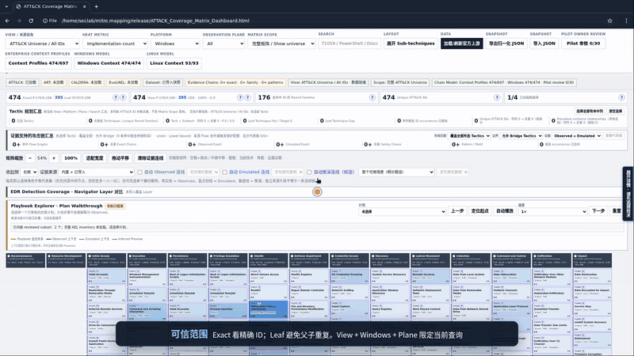

最近，我把 [Detection Coverage Workbench](https://github.com/stevenpsm/detection-coverage-workbench) 开源了。

它不是因为我想再做一张 ATT&CK 矩阵才出现的。更直接的原因，是我在工作里遇到了一个越来越难绕开的问题：怎样为产线持续、批量地生产验证数据，用来检查 EDR 对 TTP 的检测覆盖和行为遥测能力？

这件事做久了，困难很快就不再是“还能不能多实现几个 Technique”。我需要知道远期目标是什么，阶段目标应该落在哪里；也需要回头看前期已经积累的一批 Technique 研究，判断这些历史产出离目标还有多远。已有多少、缺多少、先补哪里，看起来都是简单问题，真正开始统计时却很容易失去共同口径。

与此同时，我也在设计一套新的数据生产架构。我希望借助大模型，把沉淀下来的 TTP 研究转化为可编排的知识，再由模型参与 TTP 组件的组装开发和测试样本的批量编译。但“让模型来组装”只是最容易说出口的一句话。哪些 TTP 真的可以接在一起？前一步产生的状态，能否满足后一步的条件？主机、账户、进程和文件是不是同一个作用范围？历史溯源和样本分析报告里的攻击链结论，又应该怎样成为编排依据，而不是只作为一段读过就放下的文字？

这些问题促使我开始做这个工具。它目前更像是后续数据生产体系的一层知识工作台：先帮助我看清覆盖空间、历史积累和候选路径，再为检测工程同事提供一些可以复用的数据结构与分析方法。

本文对应首个公开版本 `v2026-09-playbook-ael-r2`。

*演示：从 EDR 覆盖差距进入 Technique 上下文，再沿 Playbook 查看 ATT&CK 映射与相邻路径。*

## 一张覆盖图，最先要解决的是口径

刚开始整理历史产出时，我最自然的做法也是数 ATT&CK ID。但很快就会碰到一些不太好回答的问题。

一个 Parent Technique 和它下面已经覆盖的 Sub-technique，应该算一个还是多个？同一个 Technique 出现在多个 Tactic 中，要按 ID 去重，还是按 ID 与 Tactic 的位置分别计算？Navigator Layer 里有一个条目，究竟表示已经实现、已经启用，还是只做过研究？

如果这些口径不先固定，百分比可以很漂亮，却很难拿来安排工作。

Detection Coverage Workbench 允许导入 EDR 或内部检测内容的 ATT&CK Navigator Layer，并要求使用者明确选择 Covered 的判定规则，例如按 `enabled`、正分数或指定分数阈值计算。统计既可以使用 exact ATT&CK ID，也可以保留 ID 与 Tactic 的位置关系；还可以按平台、观测面和当前视图收缩目标范围。

我在工具里加入了 `Leaf Technique Unit` 这个派生口径，用来避免父技术与子技术在同一分母中重复计算。它不是 MITRE 新增的对象类型，最终仍然落到官方 Technique/Sub-technique ID。这个设计看似只是统计细节，实际决定了“当前覆盖”和“目标覆盖”能不能放在一起比较。

导入目标 Layer 后，矩阵可以只保留 Gap，也可以对选中的多个 Tactic 做 ID 去重汇总。对我来说，它首先回答了两个基础问题：目标空间是什么，以及历史沉淀映射到这个空间后还缺什么。

但它现在还不会自动替团队决定优先级。优先级至少还要结合威胁暴露、平台规模、遥测可得性、组件实现成本、环境准备成本和验证风险。工具能够把 Gap 和现有证据摆出来，也能为这些因素提供输入；真正的阶段排序，仍需要团队明确自己的策略。把“差距可见”直接写成“优先级已经算好”，反而会掩盖最重要的工程判断。

## 历史研究不能只剩下一个 Technique ID

前期研究留下来的内容并不少，但我逐渐意识到，仅仅保存 ATT&CK 映射，对后续自动编排并不够。

一条报告写到某个进程下载文件，随后由另一个进程加载；一份样本分析描述了凭据、会话和权限如何变化；一次溯源把几个动作放进了同一条攻击路径。这些信息真正有价值的部分，不只是其中出现了哪些 ID，而是动作发生在什么范围、以什么顺序发生、前后共享了什么对象，以及原始材料到底支持“观察到”“计划执行”还是“分析者推测”。

因此，项目把这类知识拆成了两层。

第一层是 Flow Evidence。它记录一次事件、样本运行、实验或仿真计划中的行为 occurrence，保留动作之间有证据支持的先后、分支或条件关系，同时绑定来源位置、作用范围和 ATT&CK 映射。两个 TTP 出现在同一篇文章里，不会因此自动获得一条边；一份报告只描述静态能力，也不会被提升成实际攻击成功。

第二层是 Context Profile。它试着回答一个更适合工程实现的问题：一个具体 TTP 变体在什么平台和执行范围内成立，需要哪些前置状态，会产生、消耗或使哪些状态失效，作用于什么对象，可能留下哪些遥测，又有哪些限制和反例。

我希望这种结构最终能让检测工程同事复用的不只是“某报告映射到了 T1059”，而是更接近下面这样的知识：这个实现需要什么权限和会话，产生的进程或文件能否成为下一步的输入，哪些字段可以把两步行为关联起来，以及在哪些环境里这条关系不成立。

目前项目已经能接纳公开调查、样本分析、取证材料、内部事件和仿真计划等不同来源，并把来源、范围和证据等级保留下来。不过，自然语言、PDF 或 OCR 内容并不是丢给模型就会自动变成可靠事实。模型可以参与抽取，结果仍需要做语义复核、来源绑定和反例检查。Schema 通过只能说明结构正确，不能证明对原文的理解正确。

## 哪些 TTP 可以组装，不能只看 ID 是否相邻

这是整个项目里我思考最多、也最不愿意过早下结论的一部分。

如果把 TTP 当成几个名字或命令，所谓编排很容易退化成列表拼接。但我要生产的是能够进入实验环境的多 TTP 样本。前一步是否成功、输出了什么对象、后一步是否在同一主机和账户上下文中运行，都会改变这条链到底能不能成立。

所以，项目目前采用的是有状态、受约束的组合思路：把前置条件、状态变化、实体绑定、生命周期和失败分支显式写出来，再判断一个 Profile 的输出能否满足另一个 Profile 的输入。只有在给定场景中条件能够对齐的关系，才进入 Stateful Inferred 候选；缺少可信上下文的条目保持未知，而不是为了让图更密就自动补边。

工作台把相邻关系分成三类：

| 关系层 | 我怎样理解它 | 它不能证明什么 |
| --- | --- | --- |
| Observed | 调查、事件或样本材料支持的行为关系 | 不代表换一个环境仍会按相同路径发生 |
| Emulated | 仿真计划明确描述的步骤关系 | 不代表计划已经执行或 EDR 已经检出 |
| Stateful Inferred | 前置条件、状态效果和范围绑定能够对齐的候选关系 | 不代表组件已经开发、编译或在实验室跑通 |

这三层可以放在一张图里看，但不会互相升级。我很看重这条边界。推演的价值是找到值得开发和验证的路径，不是提前替实验写结论。

当前项目已经做出了少量有界的二步组合预览，并为错误主机、错误账户、对象不一致、条件失败等情况保留反例门禁。这说明“用上下文约束 TTP 组合”这条路线可以工作，但离大规模自动组装仍有明显距离。大量历史 Profile 还缺少完整的前置条件、状态效果、分支和绑定信息；候选关系也需要进入真实环境验证。

更需要说清楚的是：工作台本身不生成 C++/.NET 组件，不编译测试样本，也不执行攻击命令。由大模型完成组件组装开发和样本批量编译，是我正在规划的数据生产架构，而不是这个版本已经交付的能力。这个工具现在承担的是它的知识与决策基础层。

## 在攻击链里看 ATT&CK 映射怎样变化

对于已经结构化的仿真计划，Playbook Explorer 可以按显式步骤、分支、并行组和汇合点进行浏览。播放位置推进时，当前 occurrence、已经到达的 frontier 和相应 ATT&CK Technique 会同步到矩阵中。

这个交互对我很重要，因为多 TTP 样本最终不能只看一张静态的 ID 清单。我需要看到链从一步走到下一步时，覆盖了哪些 Technique，跨过了哪些 Tactic，当前步骤与前后步骤之间有哪些可观测关系。

停在某个步骤时，还可以回到这个 Technique 的详情，分别查看已有的 Observed、Emulated 和 Stateful Inferred 邻接关系。它们可以帮助研究人员发现：除了当前 Playbook 采用的下一步，还有哪些有证据或有条件支持的候选方向。

不过，当前界面提供的是“查看候选路径”，不是“自动给出可替换的可执行组件”。某个相邻 Technique 能在图上出现，不表示仓库里已经有等价实现，也不表示它满足当前实验环境的全部约束。要把候选路线变成真正的编排方案，还需要关联组件库存、环境 Profile、风险控制、清理能力和实验结果。

## 回头看，它回答了多少最初的问题

把目前的实现与最初需求逐项对照，我的判断是：它已经回答了一部分，而且更重要的是，把尚未回答的部分也暴露了出来。

| 最初的问题 | 当前能够回答到哪里 | 仍然欠缺什么 |
| --- | --- | --- |
| 如何识别远期与阶段覆盖目标 | 可以固定 ATT&CK 分母、平台和 Tactic 范围，对比目标 Layer 与当前声明覆盖 | 尚无结合风险、成本和产线容量的自动优先级模型 |
| 历史 TTP 研究离目标有多远 | 结构化并映射后的历史资产可以与目标做 Gap 对比 | 未结构化文档不能自动视为已覆盖；研究完成度也不等于检测完成度 |
| 情报中的 TTP 序列怎样用于检测工程 | 可以保存 occurrence、顺序/分支、scope、来源和证据等级，并反馈为 Context Profile | 模型抽取仍需人工语义审核，很多历史条目的上下文还不完整 |
| 哪些 TTP 可以组装 | 可以依据前置条件、状态变化和实体绑定产生有界候选 | 尚未形成全量可组装率，更没有证明候选组件能够真实执行 |
| 如何观察组合链的 ATT&CK 映射演变 | 已发布 Playbook 可以随步骤在矩阵中同步展示 | 当前只覆盖有限的已审核计划，不代表完整 AEL 或实际运行库存 |
| 每一步还有哪些编排路径 | 可以查看三类邻接关系和限定组合预览 | 还不能自动完成组件替换、代码生成、编译和安全执行 |

这张表里有不少“仍然欠缺”。我并不觉得这削弱了工具的意义。相反，对检测工程而言，知道哪个数字只是声明、哪条边只是候选、哪个环节必须等实验结果，往往比得到一个过早的覆盖率更有用。

## 我准备怎样把它接回数据生产流程

在我设想的后续流程里，这个工作台不会独立完成所有事情，而是处在规划、知识和实验之间。

首先固定长期覆盖空间，再按平台、Tactic、环境可控性和产线容量划分阶段目标；随后把已有研究、检测映射和组件库存放到同一个可比较口径下，识别真正的缺口。对于准备进入开发的 TTP，不只给出 ATT&CK ID，还要形成可版本化的上下文合同：输入状态、输出状态、作用对象、遥测预期、失败分支和清理要求。

模型可以基于这些合同提出组合方案，或者从情报中的真实序列和已有仿真计划中寻找候选路线。但候选进入样本生产前，仍要经过范围绑定、风险策略和反例门禁。组件编译完成后，实验室运行产生的遥测、告警和关联结果再反馈回来，区分“组件能执行”“EDR 有遥测”“单步能检测”和“组合后仍能关联”这几种不同的成功。

项目现在已经覆盖了这个闭环的前半段。后半段涉及真实组件库存、编译产线、靶场环境、EDR 数据和实验结果，目前仍是外部工作。也正因为如此，我更愿意把 Detection Coverage Workbench 称作数据洞察依据，而不是检测有效性的证明系统。

## 下载与反馈

项目以单文件 HTML 发布。可以从 [Release 页面](https://github.com/stevenpsm/detection-coverage-workbench/releases) 下载 `ATTACK_Coverage_Matrix_Dashboard.html`，使用 Chromium、Chrome 或 Edge 直接打开。基础矩阵、已发布的 Context Profile、关系知识和审核过的 Playbook 已经内嵌，不需要部署服务器。

当前离线版本固定使用 Enterprise ATT&CK 19.2 目录。Navigator Layer 表示输入文件中的覆盖声明，Dashboard 中的 Coverage 不等于生产环境实测检出率；Playbook 计划边也不表示命令已经执行、攻击成功或检测通过。

项目原创代码采用 Apache License 2.0。它是独立社区项目，与 MITRE 不存在隶属、赞助或背书关系，ATT&CK 数据及第三方材料继续适用各自来源条款。

如果你也在做 TTP 组件化、EDR 验证数据集、攻击链检测或遥测关联，我很想知道你怎样定义“可组装”，又怎样处理环境依赖和失败分支。欢迎在[项目仓库](https://github.com/stevenpsm/detection-coverage-workbench)提交 issue。

对我来说，这个项目目前最重要的产出，不是让矩阵上多亮几个格子，而是让我能更诚实地回答：我们现在站在哪里，下一阶段为什么先做这些，以及一条看起来合理的 TTP 链，究竟还缺多少证据才能走进产线。
