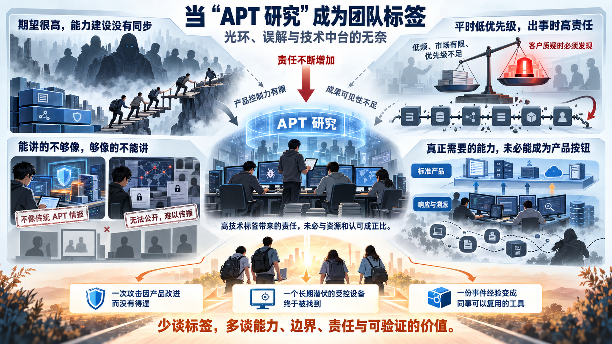

> 这是一篇个人工作感悟。文中的组织、客户和事件均作了匿名与概括处理；它讨论的是我经历过的一类组织问题，不是对某家公司或某位同事的公开评价。

*配图：围绕本文讨论的多重困境生成，概括高技术标签之下责任、产品控制力与成果可见性的失衡。*

我们团队在公司里有一个很鲜明的标签：**APT 研究**。

团队成立之初，我是真心为这个标签感到骄傲的。APT 代表网络安全领域里最复杂的一类威胁：攻击者目标明确，愿意投入时间和资源，持续调整工具与路径，以窃取、破坏或滥用高价值数据和资产。能够跟踪这些威胁，研究新的攻击技术，再把研究转化为企业里的标准流程、检测能力或产品组件，是一件很酷、也很有技术含量的事。

这个方向也确实符合团队当时的特点。我们的技术栈比较完整，既做恶意代码和漏洞研究，也做威胁情报、检测工程、事件响应和攻击溯源。比起只完成其中一个环节，我们更擅长把多个环节串起来：从一个异常行为进入，理解攻击者做了什么，找到可以规模化检测或缓解的部分，再把结论带回产品。

可在企业中台工作数年以后，我逐渐意识到：一个听起来很高级的标签，并不一定会带来与之相称的资源和理解。有时候，它反而会变成一种组织上的简化——所有人都记住了“APT”，却没有多少人真正关心这个词后面包含哪些能力、依赖什么产品基础，又有哪些事情不是一个研究团队单独能够完成的。

## 同一个“APT”，大家说的并不是同一件事

我理解的 APT，首先是一类具有定向性和持续性的威胁活动。它通常以高价值数据或资产为目标，攻击者可能具有国家背景，也可能是组织化程度很高的网络犯罪团伙。攻击者是谁、采用了什么技术、行动处在哪个阶段，是三个需要分别判断的问题。

在公司内部，“APT”却常常被理解成一档固定的技术难度，而且默认是最高档。只要提到国家背景组织，大家就容易想象成未知漏洞、复杂内存载荷、高水平隐蔽通信和长期潜伏的组合。

真实世界没有这么整齐。

威胁主体的身份并不自动等于技术上限。不同组织之间的资源、工程能力和行动纪律差异很大；同一个组织在不同任务里，也可能同时使用公开工具、成熟黑产组件和定制化能力。一些具有国家背景的行动会大量复用常见技术，部分组织化犯罪团伙反而拥有很强的漏洞利用、对抗和基础设施运营能力。

因此，“发现了国家背景组织”与“产品具备检测最高水平攻击技术的能力”并不是一回事。反过来也一样：对常见黑灰产行为检测得不错，不代表换一个攻击目标、载荷形态和行动节奏，就自然拥有了狩猎高成熟度定向攻击的能力。

令我无奈的地方，正是这种差异很难在管理讨论中被正视。研发高层有时会期待研究团队基于一套主要面向常见恶意行为建设的产品能力，持续发现最高水平的定向攻击；与此同时，对产品现有遥测、关联、取证和对抗能力的缺口又缺少耐心。

期望被放在了最高处，能力建设却仍停留在另一个层次。研究团队夹在中间，很难靠多写几份情报或多分析几个样本填平这道鸿沟。

## “不高频”与“必须发现”可以同时成立吗

另一种声音来自产线：APT 不是高频场景，市场空间有限，产品需求应该优先服务更普遍的攻击和更多客户。

单从产品经营角度看，这个判断并非毫无道理。产线要考虑研发投入、版本节奏、客户覆盖和可复制收益，不可能把全部资源投向极少数复杂事件。很多研究建议涉及更细的遥测、更长时间的关联、更完整的证据保留或更专业的调查入口，它们往往开发成本高，短期又不容易直接转化为销售数字。

问题在于，公司又会在另一种场合要求“具备 APT 能力”。客户一旦质疑产品对 APT 的检测效果，压力很自然地落到名为“APT 研究”的团队身上。

于是形成了一个很难自洽的循环：平时因为场景低频，相关产品能力难以获得优先级；事件发生后，又因为团队带着 APT 标签，能力不足被解释为研究产出不够。

但研究成果和产品能力之间，隔着遥测采集、数据质量、关联引擎、规则发布、版本覆盖、现场配置以及运营响应等一整条链路。研究团队可以提出方法、制作原型、提供数据和验证思路，却不能独自替代整条产品链。把最终效果简单归因到某一个标签团队，既无法解释问题，也不会让下一次检测变得更好。

## 最有价值的成果，未必长得像“APT 情报”

标签还会改变组织看待成果的方式。

有一段时间，公司的 EDR 自保护能力存在不足，被一些勒索团伙作为定向致盲目标。我们围绕这个问题做了大量工作：研究产品自身的攻击面，挖掘了一系列高危远程代码执行漏洞，也针对驱动层面的定向攻击提出防御方法。相关改进进入产品版本以后，帮助阻断了数百起针对产品自身的勒索攻击。

这是我认为很有实际价值的一项成果。它来自漏洞研究、对抗分析和产品协作，最终也以可规模化的方式保护了客户。可它不完全符合很多人脑海中“APT 团队应该生产情报”的想象，因此在组织叙事里很容易被当作一次临时支援，而不是团队核心能力的体现。

另一方面，我们通过情报监控和事件响应，发现并处置了近百起来自同一境外 APT 团伙的窃密活动。这些案例倒是非常符合“APT 研究”的字面定义，但其中很多涉及客户隐私和合规限制，无法公开披露。由于发现过程也不完全来自产线产品的直接告警，产线缺少主动传播这些成果的动力。

一个有点荒诞的结果是：能公开讲的成果不够像 APT，真正的 APT 成果又不能公开讲。外界看不到，内部也缺少稳定的度量与归属机制，团队最后仍可能得到一句“最近有什么新的 APT 产出吗”。

这让我慢慢认识到，中台团队的价值不只取决于做成了什么，还取决于成果能否进入组织现有的计量方式。不能成为版本功能、市场材料或公开案例的工作，即使真实地避免了损失，也很容易在下一轮讨论中重新归零。

## 有些高级威胁，本来就不是一道产品规则题

对于技术成熟度较高的攻击者，我越来越不相信“只要规则足够多，产品就应该彻底检出和阻断”这种说法。

攻击者会改变载荷、父子进程、执行链路和通信基础设施，也会利用合法工具、被盗凭据和客户环境中的正常管理能力。产品当然应该尽力采集关键行为、识别异常关系并提高攻击成本，但面对低频、定向且持续调整的行动，单点告警不可能承担全部责任。

真正有效的对抗往往还需要响应和溯源：从零散迹象中恢复时间线，识别受控设备与账户，理解攻击基础设施之间的联系，再通过持续监控逐步压缩攻击者的活动空间。这些能力不一定表现为一次“成功拦截”，却可能决定一次长期威胁能否被真正遏制。

我们为此开发过不少调查、溯源和威胁狩猎工具，也在面向真实客户环境的响应与溯源竞赛中验证过能力。但这类工具长期难以进入标准产品版本，更多时候只在团队直接参与的事件中使用。比赛成绩、复杂事件里的判断，以及那些没有变成产品按钮的工程积累，也很难获得与常规版本功能相同的认可。

这不完全是谁不重视技术的问题。标准产品追求稳定、易用和规模化交付，响应工具往往依赖专家判断、现场数据和不断变化的假设，两者天然存在距离。真正的问题是，如果公司需要后一种能力，却又只用前一种能力的标准衡量价值，那么承担这项工作的团队就会长期处于尴尬位置。

## 标签为什么会从光环变成负担

回头看，“APT 研究”这个标签至少造成了三种压缩。

它压缩了能力边界。漏洞研究、产品安全、检测工程、取证响应和基础设施追踪，被压成了“生产 APT 情报”这一种输出。

它压缩了责任链条。产品遥测、版本覆盖和运营流程共同造成的问题，最后可能被压成“APT 团队为什么没发现”。

它也压缩了成果的可见性。凡是不符合标签想象、无法公开或没有直接进入产品告警的价值，很容易从组织记忆中消失。

高技术标签于是形成了一种不对称：它带来的责任非常具体，带来的认可却很抽象。团队需要对最困难、最少见也最难证明的场景负责，却未必拥有相应的产品控制力、数据权限和发布通道。

更麻烦的是，标签通常听起来足够荣耀，以至于身处其中的人很难公开表达这种不对称。抱怨资源不足，似乎是在为结果找借口；强调产品边界，又容易被理解成研究能力不够。久而久之，团队只能继续背着这个名字，努力用局部成果回应一个定义不断变化的问题。

## 我现在更愿意谈能力，而不是标签

经历这些以后，我并没有否定 APT 研究的价值，也不后悔做过那些事情。直到今天，我仍然认为理解高水平攻击者、把事件知识转化为可复用能力，是安全企业应该长期投入的方向。

只是我不再相信一个标签本身能够建立这种能力。

相比“我们有一个 APT 团队”，我现在更愿意追问一些具体问题：我们能够看到哪些行为和证据？能否把一次事件的方法沉淀为稳定的数据、检测或调查流程？研究结论通过什么机制进入产品？产品无法解决的部分，是否存在专家响应和持续运营的交付路径？不同部门分别对哪一段结果负责？那些因合规不能公开的成果，又怎样在内部得到审计和认可？

这些问题听起来没有“APT”那么酷，却更接近能力建设本身。

如果重新设计这类团队在企业里的位置，我希望标签只用来说明研究方向，而不被用作责任的终点。团队的工作应该拆成能够被验证的能力和交付：威胁研究提供了什么新认识，检测工程补上了什么遥测或规则，产品完成了哪些版本能力，响应工作处置了什么风险，知识又怎样回流到下一次检测与调查。

有些成果适合进入产品，有些适合进入专业服务，还有一些只适合成为内部储备。它们可以采用不同的评价方式，而不必都伪装成一条“产品直接发现 APT”的案例。

## 写在最后

年轻一些的时候，我会很自然地向往一个听起来足够高级的技术标签。它意味着难题、专业性，也意味着自己正在做重要的事。

现在我更警惕标签带来的简化。越是高级的标签，越容易承载不受约束的期待；越是复杂的工作，越难用一个名字说明价值。当能力边界、协作责任和成果归属没有被认真定义时，光环很快就会变成重量。

真正让我仍然愿意做下去的，并不是“APT 研究”这几个字，而是那些更朴素的事情：一次攻击因为产品改进没有得逞，一个长期潜伏的受控设备终于被找到，一份难以复用的事件经验变成了下一位同事可以使用的工具。

这些事情未必都能装进标签里。但对我来说，它们才是技术团队真正留下来的东西。
